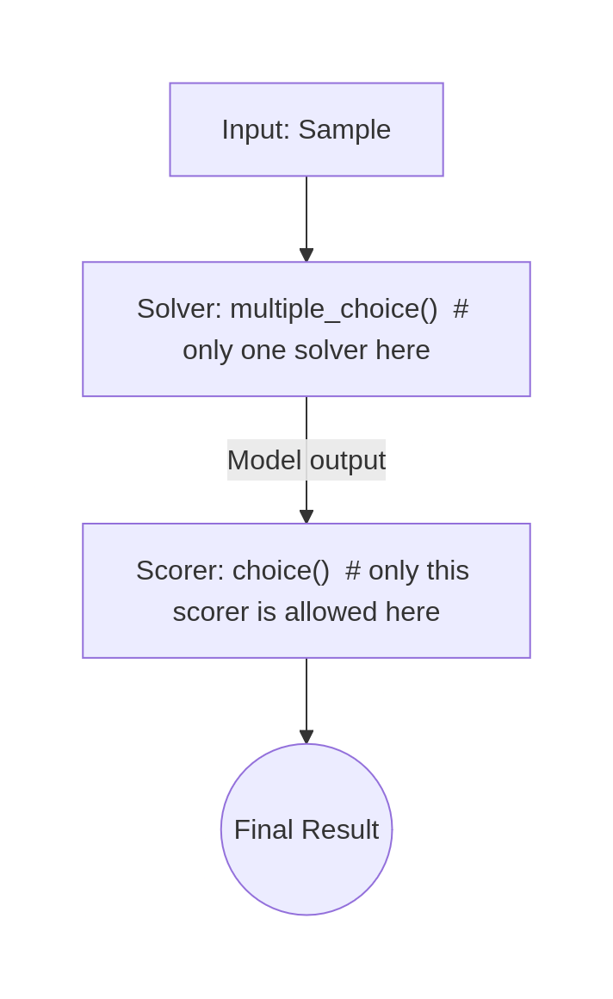

# Inspect AI tutorial

...

# FAQ

<details>
<summary>How much memory does it take to run local models?</summary>

On CPU, for ollama:

| Model            | Context window (by default in ollama) (tokens) | RAM (est.) |
|------------------|------------------------------------------------|------------|
| llama 3 8B       | 4096                                           | 5.5 GB     |
| qwen 2.5 3B      | 4096                                           | 2.3 GB     |
| deepseek-r1 1.5B | 4096                                           | 1.6 GB     |

To estimate the memory usage for other models, you can try using them yourself or use the corresponding formulas.

</details>

<details>
<summary>How to share notebooks with Inspect widgets (evals() output)?</summary>

When you commit a Jupyter Notebook containing `inspect_ai` progress widgets to GitHub, the interactive components do not display. Instead, some sites, including GitHub, only render a static `Output()` text placeholder.

## Option 1: Use Jupyter NBViewer (easiest way)

[Jupyter NBViewer](https://nbviewer.org) reads the saved widget state directly from your `.ipynb` file's content and renders it visually as a static webpage.

1. Enable automatic widget state saving in your Jupyter:
    * **JupyterLab**: Go to **Settings** -> Check **Save Widget State Automatically**.
    * **Classic Notebook**: Go to **Widgets** -> Click **Save Notebook Widget State**.
2. Run your cells so the widgets appear on your screen, then save the notebook.
3. Commit and push your `.ipynb` file to your GitHub repository.
4. Copy your GitHub notebook URL and paste it into the [Jupyter NBViewer](https://nbviewer.org).

## Option 2: Export Notebook to HTML

You can convert your notebook (with saved widgets) into a standalone HTML file to share it on your site.

```bash
jupyter nbconvert --to html your_notebook.ipynb
```
</details>

<details>
<summary>Why some cells are slow?</summary>    

It takes some time (especially when using local models, e.g. with Ollama) to run the `eval()` function. So don't rerun these cells if it is not necessary. Also, you can use fewer examples via the `eval(limit=1)` param to test your setup.
</details>

<details>
<summary>My task was interrupted. What should I do?</summary>

If your run was interrupted, you can continue it if you have defined the task as follows and saved the interim logfile.

```python
from inspect_ai import Task, task, eval, eval_retry

@task
def final_task():
    return Task(
            dataset=...
    )
...

result = eval(...)  # it creates log file when it starts

...

log = eval_retry("logs/your_log_name.eval")[0]
```

</details>

<details>
<summary>How to use `multiple_choice()` solver? How to make multiple choice question with CoT?</summary>

The `multiple_choice()` replaces the chain of solvers (and nothing else) - it handles prompting and generation internally. Also, you can only use `choice()` scorer with the `multiple_choice()` solver. So it will look _exactly_ like this:



To use the `multiple_choice()` with CoT, use `multiple_choice(cot=True)`. You can also directly change template while NOT using `cot` param, using `template` param. For additional help [check docs](https://inspect.aisi.org.uk/reference/inspect_ai.solver.html#multiple_choice).

DO NOT stack `chain_of_thought()` + `multiple_choice()`.
</details>

<details>
<summary>How do agents use resource? Do they only use the last message?</summary>

Agents use a lot of resources: each message, each tool call result, and each scaffold message is in the context window. The context window cannot be infinitely long: LLMs by design are constrained by a fixed context window size.

For a local model, the dependency is linear: for example, running Llama 3 (8B) on a CPU costs 0.5 GB of RAM for every 4,096 tokens of maximum context size, up to ~130k tokens, in addition to 4.8 GB of model weights. (Ollama allocates all the memory at once at the beginning of the model run.)

CPU LLM engines (e.g., Ollama) take more memory with each new generated token, and it takes more time to generate each new token as well (because CPU RAM is very slow).

Tip: Models are prone to forgetting information from the middle of their context. Therefore, the effective context is much smaller than the maximum. Increasing the context window and the number of messages probably won't be very effective.

</details>

<details>
<summary>other question?</summary>
<!-- do not delete it before prod-->
...
</details>
